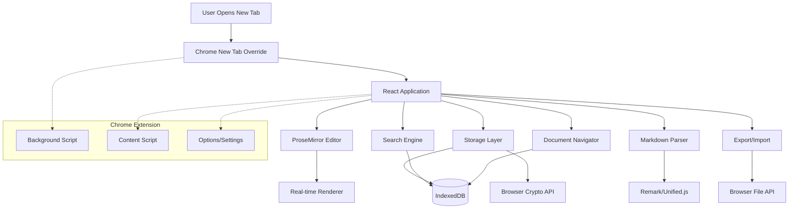
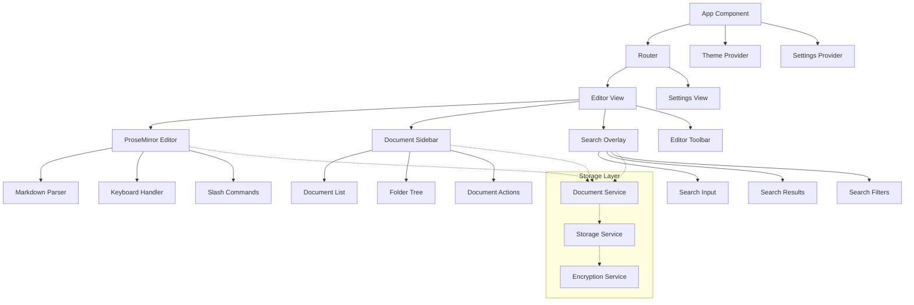
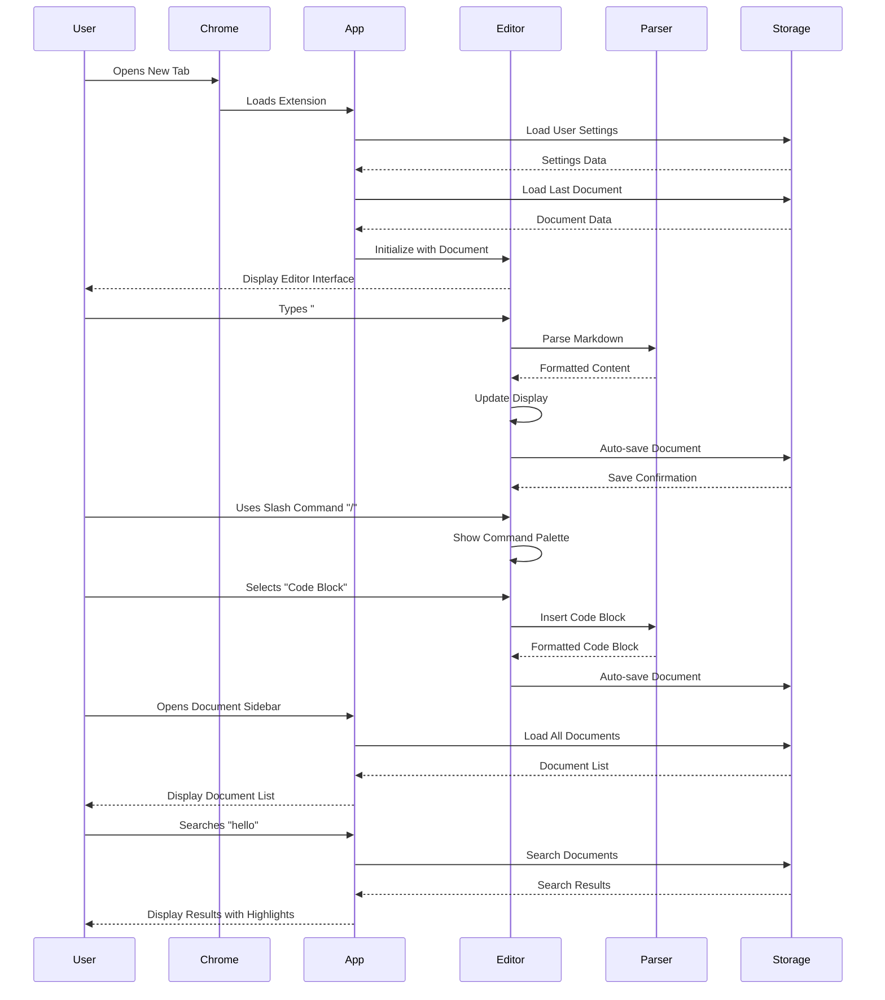
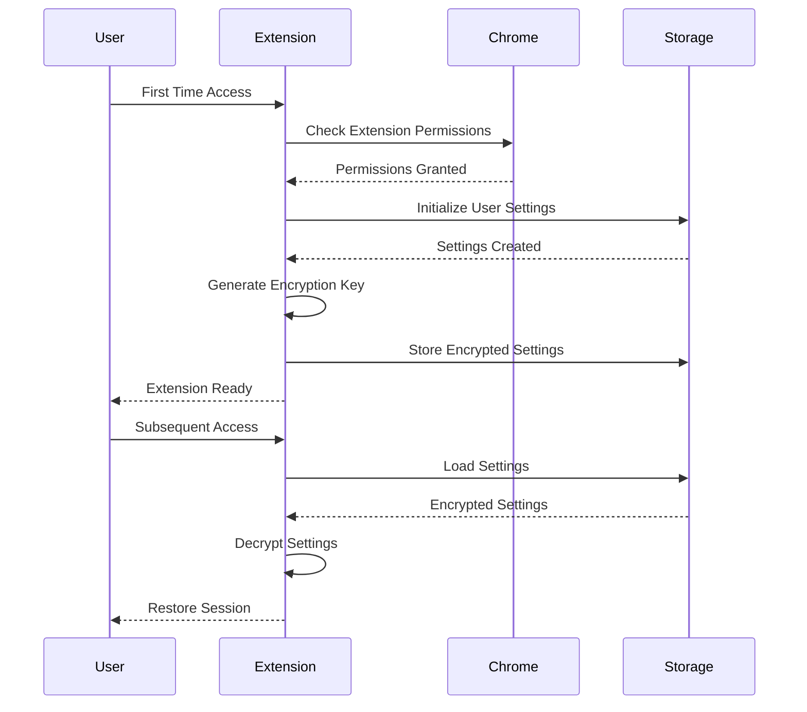
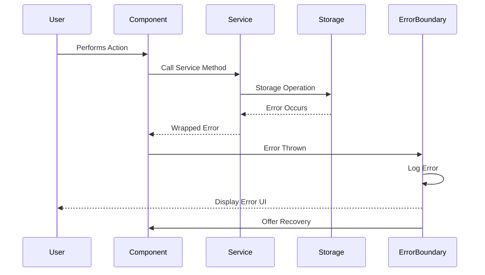

# WYSIWYG Markdown Editor Chrome Extension Fullstack Architecture Document

## Introduction

This document outlines the complete fullstack architecture for the WYSIWYG Markdown Editor Chrome Extension, including frontend implementation, local storage systems, and Chrome extension integration. It serves as the single source of truth for AI-driven development, ensuring consistency across the entire technology stack.

This unified approach addresses the unique challenges of creating a privacy-first, local-only Chrome extension that provides Notion-like editing experience with immediate markdown rendering, optimized for performance and user privacy.

### Starter Template or Existing Project

**Decision:** Greenfield project with carefully selected proven libraries for Chrome extension best practices.

**Rationale:** Custom greenfield approach chosen because:
- Unique requirements (new tab override + immediate markdown rendering) are specialized
- Performance constraints require precise control over bundle size and memory usage
- Chrome extension Manifest V3 requirements need specific optimization
- Editor customization requires exact control over markdown parsing and rendering behavior

### Change Log
| Date | Version | Description | Author |
|------|---------|-------------|---------|
| 2025-09-11 | v1.0 | Initial architecture creation | Winston (Architect) |

## High Level Architecture

### Technical Summary

This Chrome extension employs a client-side only architecture using Manifest V3 with React/TypeScript frontend, ProseMirror-based rich text editing, and IndexedDB for local persistence. The system intercepts Chrome's new tab page to provide instant access to a WYSIWYG markdown editor that converts markdown syntax to formatted text in real-time without displaying raw markdown. All data remains local using browser storage APIs with encryption, ensuring complete privacy while delivering Notion-quality editing experience optimized for desktop workflows and sub-500ms load times.

### Platform and Infrastructure Choice

**Platform:** Browser Extension (Chrome Manifest V3)
**Key Services:** Chrome Extension APIs, IndexedDB, Browser Storage APIs
**Deployment Host and Regions:** Chrome Web Store (Global Distribution)

**Rationale:** Browser extension platform chosen because:
- Direct integration with Chrome new tab functionality
- Complete local storage without external dependencies
- Instant availability without separate application installation
- Maximum privacy with no server infrastructure required

### Repository Structure

**Structure:** Monorepo
**Monorepo Tool:** npm workspaces
**Package Organization:** Shared types, UI components, and core editor logic separated for maintainability

### High Level Architecture Diagram



### Architectural Patterns

- **Component-Based Architecture:** React components with TypeScript for type safety and reusability - _Rationale:_ Maintainable UI development with strong typing for complex editor interactions
- **Document-Centric Design:** All functionality centers around document entities and operations - _Rationale:_ Aligns with user mental model of managing multiple notes/documents
- **Real-time Rendering Pipeline:** Immediate markdown-to-rich-text conversion without intermediate states - _Rationale:_ Core differentiator providing Notion-like experience without markdown exposure
- **Local-First Data Architecture:** All persistence and operations happen locally with no external dependencies - _Rationale:_ Maximum privacy and offline functionality as stated in requirements
- **Event-Driven State Management:** React Context and reducers for predictable state updates - _Rationale:_ Manages complex editor state, document switching, and search operations reliably
- **Layered Storage Architecture:** Abstraction layer over browser storage APIs with encryption - _Rationale:_ Enables testing, future migration options, and security requirements

## Tech Stack

### Technology Stack Table

| Category | Technology | Version | Purpose | Rationale |
|----------|------------|---------|---------|-----------|
| Frontend Language | TypeScript | 5.0+ | Type-safe development | Essential for complex editor logic and Chrome API integration |
| Frontend Framework | React | 18.2+ | UI component architecture | Mature ecosystem, excellent dev tools, component reusability |
| UI Component Library | Headless UI + Tailwind | Latest | Accessible base components | Unstyled components with full design control for editor UI |
| State Management | React Context + useReducer | Built-in | Application state | Sufficient for local-only app, avoids external dependencies |
| Rich Text Editor | ProseMirror | 1.18+ | Advanced text editing | Industry standard for complex editing, excellent markdown integration |
| Markdown Parser | Remark/Unified.js | 10.0+ | Markdown processing | Robust parsing ecosystem, extensible, widely adopted |
| Local Storage | IndexedDB (via Dexie) | Latest | Document persistence | Large storage capacity, structured data, transaction support |
| Encryption | Web Crypto API | Native | Data security | Native browser encryption, no external dependencies |
| Build Tool | Vite | 4.0+ | Fast development builds | Superior dev experience, optimized for modern JS |
| Bundler | Rollup (via Vite) | Latest | Production builds | Tree shaking, code splitting, Chrome extension optimization |
| Testing Framework | Vitest + React Testing Library | Latest | Unit and integration tests | Fast test runner, excellent React integration |
| E2E Testing | Playwright | Latest | Extension testing | Chrome extension support, reliable automation |
| Linting | ESLint + Prettier | Latest | Code quality | Consistent code style, error prevention |
| Type Checking | TypeScript Compiler | 5.0+ | Static analysis | Compile-time error detection |
| CSS Framework | Tailwind CSS | 3.3+ | Styling system | Rapid development, consistent design system |
| Chrome Extension | Manifest V3 | Latest | Extension platform | Required for new Chrome extensions |

## Data Models

### Document

**Purpose:** Core entity representing a markdown document with metadata and content

**Key Attributes:**
- id: string - Unique identifier for the document
- title: string - User-defined document title
- content: string - Rich text content (stored as ProseMirror JSON)
- markdownSource: string - Original markdown for export purposes
- createdAt: Date - Document creation timestamp
- updatedAt: Date - Last modification timestamp
- folderId: string | null - Optional folder organization
- tags: string[] - Document tags for organization
- isDeleted: boolean - Soft delete flag
- wordCount: number - Cached word count for performance

#### TypeScript Interface
```typescript
interface Document {
  id: string;
  title: string;
  content: any; // ProseMirror JSON document
  markdownSource: string;
  createdAt: Date;
  updatedAt: Date;
  folderId: string | null;
  tags: string[];
  isDeleted: boolean;
  wordCount: number;
  version: number;
}
```

#### Relationships
- Documents belong to optional Folders
- Documents can have multiple Tags
- Documents have History entries for version tracking

### Folder

**Purpose:** Hierarchical organization container for documents

**Key Attributes:**
- id: string - Unique identifier for the folder
- name: string - User-defined folder name
- parentId: string | null - Parent folder for nesting
- createdAt: Date - Folder creation timestamp
- color: string - Optional color coding

#### TypeScript Interface
```typescript
interface Folder {
  id: string;
  name: string;
  parentId: string | null;
  createdAt: Date;
  color?: string;
}
```

#### Relationships
- Folders can contain multiple Documents
- Folders can have child Folders (hierarchical)

### UserSettings

**Purpose:** User preferences and configuration options

**Key Attributes:**
- theme: string - Light/dark/system theme preference
- fontSize: number - Editor font size
- fontFamily: string - Editor font family
- autoSave: boolean - Auto-save enabled
- keyboardShortcuts: object - Custom shortcut mappings

#### TypeScript Interface
```typescript
interface UserSettings {
  theme: 'light' | 'dark' | 'system';
  fontSize: number;
  fontFamily: string;
  autoSave: boolean;
  keyboardShortcuts: Record<string, string>;
  defaultView: 'editor' | 'sidebar';
  searchScope: 'all' | 'current-folder';
}
```

#### Relationships
- Single UserSettings entity per extension installation

## API Specification

**Note:** This Chrome extension operates entirely locally with no external API. All data operations use browser storage APIs and local processing. The "API" is internal service layer patterns for data access.

### Internal Service Interface

```typescript
// Document Service Interface
interface DocumentService {
  // CRUD Operations
  createDocument(data: Partial<Document>): Promise<Document>;
  getDocument(id: string): Promise<Document | null>;
  updateDocument(id: string, data: Partial<Document>): Promise<Document>;
  deleteDocument(id: string): Promise<void>;
  
  // Query Operations
  getAllDocuments(): Promise<Document[]>;
  getDocumentsByFolder(folderId: string): Promise<Document[]>;
  searchDocuments(query: string): Promise<Document[]>;
  
  // Bulk Operations
  exportDocuments(ids: string[]): Promise<Blob>;
  importDocuments(files: FileList): Promise<Document[]>;
}

// Storage Service Interface
interface StorageService {
  get<T>(key: string): Promise<T | null>;
  set<T>(key: string, value: T): Promise<void>;
  remove(key: string): Promise<void>;
  clear(): Promise<void>;
  encrypt(data: string): Promise<string>;
  decrypt(encryptedData: string): Promise<string>;
}
```

## Components

### Editor Component

**Responsibility:** Core ProseMirror-based rich text editor with immediate markdown rendering

**Key Interfaces:**
- Document content management (create, edit, format)
- Real-time markdown-to-rich-text conversion
- Keyboard shortcut handling
- Slash command processing

**Dependencies:** ProseMirror, Remark parser, Document storage service

**Technology Stack:** React component wrapping ProseMirror EditorView with custom schema for markdown elements

### Document Navigator

**Responsibility:** Sidebar component for document browsing, organization, and management

**Key Interfaces:**
- Document list display with folders
- Document creation/deletion/renaming
- Folder management and organization
- Drag-and-drop document organization

**Dependencies:** Document service, Folder service, Search service

**Technology Stack:** React component with virtualized lists for performance, drag-and-drop via react-beautiful-dnd

### Search Engine

**Responsibility:** Full-text search across all documents with real-time results

**Key Interfaces:**
- Text search with highlighting
- Filter by folder/tags
- Search result navigation
- Search history management

**Dependencies:** Document storage, indexing service

**Technology Stack:** Custom search implementation using IndexedDB full-text indexing with Fuse.js for fuzzy matching

### Storage Manager

**Responsibility:** Abstraction layer over browser storage with encryption and performance optimization

**Key Interfaces:**
- CRUD operations for all data types
- Automatic encryption/decryption
- Cache management and performance optimization
- Data export/import functionality

**Dependencies:** IndexedDB, Web Crypto API

**Technology Stack:** Dexie.js for IndexedDB management with custom encryption wrapper

### Theme Manager

**Responsibility:** Dynamic theme switching and customization management

**Key Interfaces:**
- Theme application and switching
- System preference detection
- Custom color scheme management
- Typography customization

**Dependencies:** UserSettings service

**Technology Stack:** CSS custom properties with React Context for theme state

### Component Diagrams



## External APIs

**No external APIs required.** This extension operates entirely locally for privacy and offline functionality. All operations use browser-native APIs:

- **Chrome Extension APIs** - For new tab override and extension lifecycle
- **IndexedDB API** - For local document storage
- **File System Access API** - For import/export operations
- **Web Crypto API** - For local data encryption

## Core Workflows



## Database Schema

```sql
-- IndexedDB Object Stores Schema

-- Documents Store
Documents {
  id: string (primary key),
  title: string (indexed),
  content: any, // ProseMirror JSON
  markdownSource: string,
  createdAt: Date (indexed),
  updatedAt: Date (indexed),
  folderId: string (indexed),
  tags: string[] (multiEntry indexed),
  isDeleted: boolean (indexed),
  wordCount: number,
  version: number
}

-- Folders Store
Folders {
  id: string (primary key),
  name: string (indexed),
  parentId: string (indexed),
  createdAt: Date,
  color: string
}

-- Settings Store
Settings {
  id: 'user-settings' (primary key),
  theme: string,
  fontSize: number,
  fontFamily: string,
  autoSave: boolean,
  keyboardShortcuts: object,
  defaultView: string,
  searchScope: string
}

-- Search Index Store
SearchIndex {
  id: string (primary key), // documentId
  searchableText: string, // Full text for search
  lastIndexed: Date
}

-- Backup Store
Backups {
  id: string (primary key), // timestamp-based
  data: any, // Full data export
  createdAt: Date,
  type: 'auto' | 'manual'
}

-- Compound Indexes
Documents: [folderId, updatedAt] // For folder-based sorting
Documents: [isDeleted, updatedAt] // For active document queries
SearchIndex: [searchableText] // For full-text search
```

## Frontend Architecture

### Component Architecture

#### Component Organization
```
src/
├── components/
│   ├── editor/
│   │   ├── ProseMirrorEditor.tsx
│   │   ├── Toolbar.tsx
│   │   ├── SlashCommands.tsx
│   │   └── KeyboardShortcuts.tsx
│   ├── sidebar/
│   │   ├── DocumentSidebar.tsx
│   │   ├── DocumentList.tsx
│   │   ├── FolderTree.tsx
│   │   └── DocumentActions.tsx
│   ├── search/
│   │   ├── SearchOverlay.tsx
│   │   ├── SearchInput.tsx
│   │   ├── SearchResults.tsx
│   │   └── SearchFilters.tsx
│   ├── ui/
│   │   ├── Button.tsx
│   │   ├── Modal.tsx
│   │   ├── Input.tsx
│   │   └── Dropdown.tsx
│   └── layout/
│       ├── AppLayout.tsx
│       ├── Header.tsx
│       └── StatusBar.tsx
```

#### Component Template
```typescript
import React, { useCallback, useEffect, useState } from 'react';
import { Document } from '@/types';
import { useDocuments } from '@/hooks/useDocuments';

interface EditorComponentProps {
  documentId: string;
  onDocumentChange: (doc: Document) => void;
  className?: string;
}

export const EditorComponent: React.FC<EditorComponentProps> = ({
  documentId,
  onDocumentChange,
  className = ''
}) => {
  const { document, updateDocument, isLoading } = useDocuments(documentId);
  const [editorState, setEditorState] = useState(null);

  const handleContentChange = useCallback((content: any) => {
    if (document) {
      const updatedDoc = { ...document, content, updatedAt: new Date() };
      updateDocument(documentId, updatedDoc);
      onDocumentChange(updatedDoc);
    }
  }, [document, documentId, updateDocument, onDocumentChange]);

  if (isLoading) return <div>Loading...</div>;

  return (
    <div className={`editor-component ${className}`}>
      {/* Editor implementation */}
    </div>
  );
};
```

### State Management Architecture

#### State Structure
```typescript
interface AppState {
  // Current user session
  currentDocument: Document | null;
  
  // UI State
  ui: {
    sidebarOpen: boolean;
    searchOpen: boolean;
    theme: 'light' | 'dark' | 'system';
    loading: boolean;
  };
  
  // Document Management
  documents: {
    items: Document[];
    folders: Folder[];
    searchResults: Document[];
    searchQuery: string;
  };
  
  // Editor State
  editor: {
    editorState: any; // ProseMirror state
    hasUnsavedChanges: boolean;
    wordCount: number;
  };
  
  // Settings
  settings: UserSettings;
}

// Action Types
type AppAction =
  | { type: 'SET_CURRENT_DOCUMENT'; payload: Document }
  | { type: 'UPDATE_DOCUMENT'; payload: { id: string; changes: Partial<Document> } }
  | { type: 'TOGGLE_SIDEBAR' }
  | { type: 'SET_SEARCH_QUERY'; payload: string }
  | { type: 'SET_SEARCH_RESULTS'; payload: Document[] }
  | { type: 'UPDATE_SETTINGS'; payload: Partial<UserSettings> };
```

#### State Management Patterns
- Centralized state with React Context and useReducer for complex state logic
- Local component state for ephemeral UI state (input values, hover states)
- Custom hooks for data fetching and business logic abstraction
- Optimistic updates for smooth user experience with rollback capability

### Routing Architecture

#### Route Organization
```
/ (root) - Main editor interface with last opened document
/document/:id - Specific document view
/settings - Extension settings and preferences
/search - Global search interface
/export - Document export interface
```

#### Protected Route Pattern
```typescript
interface ProtectedRouteProps {
  children: React.ReactNode;
  requiredSetup?: boolean;
}

const ProtectedRoute: React.FC<ProtectedRouteProps> = ({ 
  children, 
  requiredSetup = false 
}) => {
  const { isSetupComplete, isLoading } = useExtensionSetup();
  
  if (isLoading) {
    return <LoadingSpinner />;
  }
  
  if (requiredSetup && !isSetupComplete) {
    return <Navigate to="/setup" replace />;
  }
  
  return <>{children}</>;
};
```

### Frontend Services Layer

#### API Client Setup
```typescript
// Storage Service - Abstraction over browser storage
class StorageService {
  private db: Dexie;
  
  constructor() {
    this.db = new Dexie('WysiwygMdEditor');
    this.db.version(1).stores({
      documents: '&id, title, folderId, *tags, createdAt, updatedAt, isDeleted',
      folders: '&id, name, parentId',
      settings: '&id',
      searchIndex: '&id, searchableText',
      backups: '&id, createdAt'
    });
  }
  
  async getDocument(id: string): Promise<Document | null> {
    return await this.db.documents.get(id);
  }
  
  async saveDocument(document: Document): Promise<void> {
    await this.db.documents.put(document);
    await this.updateSearchIndex(document);
  }
  
  private async updateSearchIndex(document: Document): Promise<void> {
    const searchableText = this.extractSearchableText(document.content);
    await this.db.searchIndex.put({
      id: document.id,
      searchableText,
      lastIndexed: new Date()
    });
  }
}
```

#### Service Example
```typescript
// Document Service - Business logic layer
export class DocumentService {
  constructor(private storage: StorageService) {}
  
  async createDocument(title: string, folderId?: string): Promise<Document> {
    const document: Document = {
      id: generateId(),
      title,
      content: createEmptyProseMirrorDoc(),
      markdownSource: '',
      createdAt: new Date(),
      updatedAt: new Date(),
      folderId: folderId || null,
      tags: [],
      isDeleted: false,
      wordCount: 0,
      version: 1
    };
    
    await this.storage.saveDocument(document);
    return document;
  }
  
  async updateDocument(id: string, changes: Partial<Document>): Promise<Document> {
    const existing = await this.storage.getDocument(id);
    if (!existing) throw new Error('Document not found');
    
    const updated = {
      ...existing,
      ...changes,
      updatedAt: new Date(),
      version: existing.version + 1
    };
    
    await this.storage.saveDocument(updated);
    return updated;
  }
  
  async searchDocuments(query: string): Promise<Document[]> {
    return await this.storage.searchDocuments(query);
  }
}
```

## Backend Architecture

**Note:** This Chrome extension has no traditional backend. All "backend" logic runs in the browser using service workers and local storage. The architecture below describes the local data management layer.

### Service Architecture

#### Function Organization
```
src/services/
├── storage/
│   ├── StorageService.ts
│   ├── EncryptionService.ts
│   └── BackupService.ts
├── documents/
│   ├── DocumentService.ts
│   ├── SearchService.ts
│   └── ExportService.ts
├── editor/
│   ├── MarkdownService.ts
│   ├── ParsingService.ts
│   └── RenderingService.ts
└── extension/
    ├── BackgroundService.ts
    ├── TabService.ts
    └── SettingsService.ts
```

#### Service Template
```typescript
// Background Service - Chrome extension lifecycle management
export class BackgroundService {
  private static instance: BackgroundService;
  
  private constructor() {
    this.setupEventListeners();
  }
  
  static getInstance(): BackgroundService {
    if (!BackgroundService.instance) {
      BackgroundService.instance = new BackgroundService();
    }
    return BackgroundService.instance;
  }
  
  private setupEventListeners(): void {
    // Handle new tab creation
    chrome.tabs.onCreated.addListener(this.handleNewTab.bind(this));
    
    // Handle extension installation
    chrome.runtime.onInstalled.addListener(this.handleInstallation.bind(this));
    
    // Handle storage changes
    chrome.storage.onChanged.addListener(this.handleStorageChange.bind(this));
  }
  
  private async handleNewTab(tab: chrome.tabs.Tab): Promise<void> {
    // Initialize new tab with extension if needed
    if (this.isNewTabOverrideEnabled()) {
      await this.injectExtensionContent(tab.id!);
    }
  }
  
  private async handleInstallation(): Promise<void> {
    // Setup default settings and initialize storage
    await this.initializeDefaultSettings();
  }
}
```

### Database Architecture

#### Schema Design
```typescript
// Dexie Database Schema Configuration
export class EditorDatabase extends Dexie {
  documents!: Table<Document, string>;
  folders!: Table<Folder, string>;
  settings!: Table<UserSettings, string>;
  searchIndex!: Table<SearchIndexEntry, string>;
  backups!: Table<BackupEntry, string>;

  constructor() {
    super('WysiwygMdEditor');
    
    this.version(1).stores({
      documents: '&id, title, folderId, *tags, createdAt, updatedAt, isDeleted',
      folders: '&id, name, parentId, createdAt',
      settings: '&id',
      searchIndex: '&id, searchableText, lastIndexed',
      backups: '&id, createdAt, type'
    });
    
    // Add hooks for automatic timestamps and search indexing
    this.documents.hook('creating', this.addTimestamps);
    this.documents.hook('updating', this.updateTimestamps);
    this.documents.hook('creating', this.updateSearchIndex);
    this.documents.hook('updating', this.updateSearchIndex);
  }
  
  private addTimestamps = (primKey: string, obj: Document, trans: Transaction) => {
    obj.createdAt = new Date();
    obj.updatedAt = new Date();
  };
  
  private updateTimestamps = (modifications: any, primKey: string, obj: Document, trans: Transaction) => {
    modifications.updatedAt = new Date();
  };
}
```

#### Data Access Layer
```typescript
// Repository Pattern Implementation
export interface DocumentRepository {
  create(document: Omit<Document, 'id' | 'createdAt' | 'updatedAt'>): Promise<Document>;
  findById(id: string): Promise<Document | null>;
  findAll(): Promise<Document[]>;
  findByFolder(folderId: string): Promise<Document[]>;
  update(id: string, changes: Partial<Document>): Promise<Document>;
  delete(id: string): Promise<void>;
  search(query: string): Promise<Document[]>;
}

export class DexieDocumentRepository implements DocumentRepository {
  constructor(private db: EditorDatabase) {}
  
  async create(documentData: Omit<Document, 'id' | 'createdAt' | 'updatedAt'>): Promise<Document> {
    const document: Document = {
      ...documentData,
      id: generateUniqueId(),
      createdAt: new Date(),
      updatedAt: new Date(),
      version: 1
    };
    
    await this.db.documents.add(document);
    return document;
  }
  
  async findById(id: string): Promise<Document | null> {
    return await this.db.documents.get(id) || null;
  }
  
  async findByFolder(folderId: string): Promise<Document[]> {
    return await this.db.documents
      .where('folderId')
      .equals(folderId)
      .and(doc => !doc.isDeleted)
      .toArray();
  }
  
  async search(query: string): Promise<Document[]> {
    const searchTerms = query.toLowerCase().split(' ');
    
    return await this.db.documents
      .filter(doc => {
        if (doc.isDeleted) return false;
        
        const searchableContent = [
          doc.title,
          doc.markdownSource,
          ...doc.tags
        ].join(' ').toLowerCase();
        
        return searchTerms.every(term => searchableContent.includes(term));
      })
      .toArray();
  }
}
```

### Authentication and Authorization

#### Auth Flow


#### Middleware/Guards
```typescript
// Encryption Middleware for Data Protection
export class EncryptionMiddleware {
  private cryptoKey: CryptoKey | null = null;
  
  async initialize(): Promise<void> {
    this.cryptoKey = await this.getOrCreateEncryptionKey();
  }
  
  async encrypt(data: string): Promise<string> {
    if (!this.cryptoKey) throw new Error('Encryption not initialized');
    
    const encoder = new TextEncoder();
    const dataBuffer = encoder.encode(data);
    const iv = crypto.getRandomValues(new Uint8Array(12));
    
    const encryptedBuffer = await crypto.subtle.encrypt(
      { name: 'AES-GCM', iv },
      this.cryptoKey,
      dataBuffer
    );
    
    const encryptedArray = new Uint8Array(encryptedBuffer);
    const combinedArray = new Uint8Array(iv.length + encryptedArray.length);
    combinedArray.set(iv);
    combinedArray.set(encryptedArray, iv.length);
    
    return btoa(String.fromCharCode(...combinedArray));
  }
  
  async decrypt(encryptedData: string): Promise<string> {
    if (!this.cryptoKey) throw new Error('Encryption not initialized');
    
    const combinedArray = new Uint8Array(
      atob(encryptedData).split('').map(char => char.charCodeAt(0))
    );
    
    const iv = combinedArray.slice(0, 12);
    const encryptedArray = combinedArray.slice(12);
    
    const decryptedBuffer = await crypto.subtle.decrypt(
      { name: 'AES-GCM', iv },
      this.cryptoKey,
      encryptedArray
    );
    
    const decoder = new TextDecoder();
    return decoder.decode(decryptedBuffer);
  }
  
  private async getOrCreateEncryptionKey(): Promise<CryptoKey> {
    // Implementation for persistent key storage in Chrome extension storage
    const stored = await chrome.storage.local.get('encryptionKey');
    
    if (stored.encryptionKey) {
      return await crypto.subtle.importKey(
        'jwk',
        stored.encryptionKey,
        { name: 'AES-GCM' },
        false,
        ['encrypt', 'decrypt']
      );
    }
    
    const key = await crypto.subtle.generateKey(
      { name: 'AES-GCM', length: 256 },
      true,
      ['encrypt', 'decrypt']
    );
    
    const exportedKey = await crypto.subtle.exportKey('jwk', key);
    await chrome.storage.local.set({ encryptionKey: exportedKey });
    
    return key;
  }
}
```

## Unified Project Structure

```
wysiwyg-md-editor/
├── .github/                           # CI/CD workflows
│   └── workflows/
│       ├── build.yaml                 # Build and test workflow
│       └── release.yaml               # Chrome store release
├── src/                               # Main application source
│   ├── components/                    # React UI components
│   │   ├── editor/
│   │   │   ├── ProseMirrorEditor.tsx
│   │   │   ├── Toolbar.tsx
│   │   │   ├── SlashCommands.tsx
│   │   │   └── KeyboardHandler.tsx
│   │   ├── sidebar/
│   │   │   ├── DocumentSidebar.tsx
│   │   │   ├── DocumentList.tsx
│   │   │   ├── FolderTree.tsx
│   │   │   └── DocumentActions.tsx
│   │   ├── search/
│   │   │   ├── SearchOverlay.tsx
│   │   │   ├── SearchInput.tsx
│   │   │   └── SearchResults.tsx
│   │   ├── ui/                        # Reusable UI components
│   │   │   ├── Button.tsx
│   │   │   ├── Modal.tsx
│   │   │   ├── Input.tsx
│   │   │   └── Dropdown.tsx
│   │   └── layout/
│   │       ├── AppLayout.tsx
│   │       ├── Header.tsx
│   │       └── StatusBar.tsx
│   ├── hooks/                         # Custom React hooks
│   │   ├── useDocuments.ts
│   │   ├── useSearch.ts
│   │   ├── useSettings.ts
│   │   ├── useEditor.ts
│   │   └── useKeyboardShortcuts.ts
│   ├── services/                      # Business logic layer
│   │   ├── storage/
│   │   │   ├── StorageService.ts
│   │   │   ├── EncryptionService.ts
│   │   │   └── BackupService.ts
│   │   ├── documents/
│   │   │   ├── DocumentService.ts
│   │   │   ├── SearchService.ts
│   │   │   └── ExportService.ts
│   │   ├── editor/
│   │   │   ├── MarkdownService.ts
│   │   │   ├── ParsingService.ts
│   │   │   └── RenderingService.ts
│   │   └── extension/
│   │       ├── BackgroundService.ts
│   │       ├── TabService.ts
│   │       └── SettingsService.ts
│   ├── types/                         # TypeScript type definitions
│   │   ├── document.ts
│   │   ├── folder.ts
│   │   ├── settings.ts
│   │   ├── editor.ts
│   │   └── chrome.ts
│   ├── utils/                         # Utility functions
│   │   ├── markdown.ts
│   │   ├── storage.ts
│   │   ├── encryption.ts
│   │   ├── file.ts
│   │   └── validation.ts
│   ├── styles/                        # Global styles and themes
│   │   ├── globals.css
│   │   ├── themes.css
│   │   ├── editor.css
│   │   └── components.css
│   ├── pages/                         # Main application pages
│   │   ├── NewTab.tsx                 # Main new tab page
│   │   ├── Settings.tsx               # Extension settings
│   │   └── Export.tsx                 # Export/import interface
│   └── extension/                     # Chrome extension specific files
│       ├── manifest.json              # Extension manifest v3
│       ├── background.ts              # Background script
│       ├── content.ts                 # Content script
│       └── popup/                     # Extension popup
│           ├── popup.html
│           ├── popup.tsx
│           └── popup.css
├── public/                            # Static assets
│   ├── icons/                         # Extension icons
│   │   ├── icon16.png
│   │   ├── icon48.png
│   │   └── icon128.png
│   └── newtab.html                    # New tab override page
├── tests/                             # Test files
│   ├── components/                    # Component tests
│   ├── services/                      # Service layer tests
│   ├── utils/                         # Utility function tests
│   ├── e2e/                           # End-to-end tests
│   └── __mocks__/                     # Test mocks
├── scripts/                           # Build and utility scripts
│   ├── build.ts                       # Build script
│   ├── package.ts                     # Package for Chrome store
│   └── dev.ts                         # Development server
├── docs/                              # Documentation
│   ├── prd.md
│   ├── architecture.md
│   └── development.md
├── .env.example                       # Environment variables template
├── package.json                       # Dependencies and scripts
├── tsconfig.json                      # TypeScript configuration
├── vite.config.ts                     # Vite build configuration
├── tailwind.config.js                 # Tailwind CSS configuration
├── vitest.config.ts                   # Test configuration
├── .eslintrc.js                       # ESLint configuration
├── .prettierrc                        # Prettier configuration
└── README.md                          # Project documentation
```

## Development Workflow

### Local Development Setup

#### Prerequisites
```bash
# Node.js 18+ and npm
node --version  # Should be 18+
npm --version   # Should be 8+

# Chrome browser for testing
google-chrome --version
```

#### Initial Setup
```bash
# Clone and install dependencies
git clone <repository-url>
cd wysiwyg-md-editor
npm install

# Setup environment variables
cp .env.example .env

# Build extension for development
npm run build:dev

# Load extension in Chrome
# 1. Open chrome://extensions/
# 2. Enable "Developer mode"
# 3. Click "Load unpacked"
# 4. Select the dist/ directory
```

#### Development Commands
```bash
# Start development server with hot reload
npm run dev

# Build for production
npm run build

# Run all tests
npm run test

# Run E2E tests
npm run test:e2e

# Lint and format code
npm run lint
npm run format

# Type checking
npm run type-check

# Package for Chrome Web Store
npm run package
```

### Environment Configuration

#### Required Environment Variables
```bash
# Development (.env.local)
VITE_APP_NAME=WYSIWYG Markdown Editor
VITE_APP_VERSION=1.0.0
VITE_DEVELOPMENT=true
VITE_ENABLE_DEBUGGING=true

# Production (.env.production)
VITE_APP_NAME=WYSIWYG Markdown Editor
VITE_APP_VERSION=1.0.0
VITE_DEVELOPMENT=false
VITE_ENABLE_DEBUGGING=false

# Extension Specific
VITE_MANIFEST_VERSION=3
VITE_CHROME_MIN_VERSION=88
```

## Deployment Architecture

### Deployment Strategy

**Frontend Deployment:**
- **Platform:** Chrome Web Store
- **Build Command:** `npm run build`
- **Output Directory:** `dist/`
- **CDN/Edge:** Chrome's extension distribution network

**Backend Deployment:**
- **Platform:** Local browser storage (no external deployment)
- **Build Command:** N/A (local-only)
- **Deployment Method:** Extension installation

### CI/CD Pipeline
```yaml
name: Build and Release

on:
  push:
    branches: [ main, develop ]
    tags: [ 'v*' ]
  pull_request:
    branches: [ main ]

jobs:
  test:
    runs-on: ubuntu-latest
    steps:
      - uses: actions/checkout@v3
      - uses: actions/setup-node@v3
        with:
          node-version: '18'
          cache: 'npm'
      
      - run: npm ci
      - run: npm run lint
      - run: npm run type-check
      - run: npm run test
      - run: npm run test:e2e

  build:
    needs: test
    runs-on: ubuntu-latest
    steps:
      - uses: actions/checkout@v3
      - uses: actions/setup-node@v3
        with:
          node-version: '18'
          cache: 'npm'
      
      - run: npm ci
      - run: npm run build
      
      - name: Package Extension
        run: npm run package
      
      - name: Upload Build Artifacts
        uses: actions/upload-artifact@v3
        with:
          name: extension-build
          path: dist/

  release:
    if: startsWith(github.ref, 'refs/tags/v')
    needs: build
    runs-on: ubuntu-latest
    steps:
      - name: Download Build Artifacts
        uses: actions/download-artifact@v3
        with:
          name: extension-build
      
      - name: Create Release
        uses: actions/create-release@v1
        env:
          GITHUB_TOKEN: ${{ secrets.GITHUB_TOKEN }}
        with:
          tag_name: ${{ github.ref }}
          release_name: Release ${{ github.ref }}
          draft: false
          prerelease: false
```

### Environments

| Environment | Frontend URL | Backend URL | Purpose |
|-------------|--------------|-------------|---------|
| Development | chrome-extension://[id]/newtab.html | Local Storage | Local development and testing |
| Staging | chrome-extension://[staging-id]/newtab.html | Local Storage | Pre-release testing |
| Production | chrome-extension://[prod-id]/newtab.html | Local Storage | Live Chrome Web Store release |

## Security and Performance

### Security Requirements

**Frontend Security:**
- CSP Headers: `default-src 'self'; script-src 'self' 'unsafe-eval'; style-src 'self' 'unsafe-inline'`
- XSS Prevention: Content sanitization for imported markdown, React's built-in XSS protection
- Secure Storage: All sensitive data encrypted using Web Crypto API before storage

**Backend Security:**
- Input Validation: Comprehensive validation for all user inputs and imported content
- Rate Limiting: Built-in browser storage rate limiting, no additional implementation needed
- CORS Policy: N/A (no external requests)

**Authentication Security:**
- Token Storage: N/A (no authentication tokens)
- Session Management: Extension lifecycle managed by Chrome
- Password Policy: N/A (no user accounts)

### Performance Optimization

**Frontend Performance:**
- Bundle Size Target: <2MB total extension size
- Loading Strategy: Lazy loading for non-critical components, code splitting by route
- Caching Strategy: Browser cache for static assets, IndexedDB for data persistence

**Backend Performance:**
- Response Time Target: <100ms for all local operations
- Database Optimization: Indexed queries, efficient search algorithms, pagination for large datasets
- Caching Strategy: In-memory caching for frequently accessed documents, smart prefetching

## Testing Strategy

### Testing Pyramid
```
        E2E Tests (Chrome Extension)
       /                            \
  Integration Tests (Storage & Editor)
 /                                    \
Component Unit Tests    Service Unit Tests
```

### Test Organization

#### Frontend Tests
```
tests/
├── components/
│   ├── editor/
│   │   ├── ProseMirrorEditor.test.tsx
│   │   ├── Toolbar.test.tsx
│   │   └── SlashCommands.test.tsx
│   ├── sidebar/
│   │   ├── DocumentSidebar.test.tsx
│   │   └── DocumentList.test.tsx
│   └── search/
│       ├── SearchOverlay.test.tsx
│       └── SearchResults.test.tsx
├── hooks/
│   ├── useDocuments.test.ts
│   ├── useSearch.test.ts
│   └── useEditor.test.ts
└── utils/
    ├── markdown.test.ts
    ├── storage.test.ts
    └── encryption.test.ts
```

#### Backend Tests
```
tests/
├── services/
│   ├── DocumentService.test.ts
│   ├── SearchService.test.ts
│   ├── StorageService.test.ts
│   └── EncryptionService.test.ts
├── repositories/
│   ├── DocumentRepository.test.ts
│   └── FolderRepository.test.ts
└── integration/
    ├── storage-integration.test.ts
    └── search-integration.test.ts
```

#### E2E Tests
```
tests/e2e/
├── extension-lifecycle.test.ts
├── document-management.test.ts
├── editor-functionality.test.ts
├── search-functionality.test.ts
└── import-export.test.ts
```

### Test Examples

#### Frontend Component Test
```typescript
import { render, screen, fireEvent } from '@testing-library/react';
import { vi } from 'vitest';
import { ProseMirrorEditor } from '@/components/editor/ProseMirrorEditor';

describe('ProseMirrorEditor', () => {
  const mockOnChange = vi.fn();
  
  beforeEach(() => {
    mockOnChange.mockClear();
  });

  it('should render editor with initial content', () => {
    const initialContent = { type: 'doc', content: [] };
    
    render(
      <ProseMirrorEditor 
        content={initialContent}
        onChange={mockOnChange}
      />
    );
    
    expect(screen.getByRole('textbox')).toBeInTheDocument();
  });

  it('should convert markdown syntax to formatted text', async () => {
    render(
      <ProseMirrorEditor 
        content={{ type: 'doc', content: [] }}
        onChange={mockOnChange}
      />
    );
    
    const editor = screen.getByRole('textbox');
    fireEvent.input(editor, { target: { textContent: '# Hello World' } });
    
    // Wait for markdown processing
    await screen.findByRole('heading', { level: 1 });
    expect(screen.getByText('Hello World')).toBeInTheDocument();
    expect(mockOnChange).toHaveBeenCalled();
  });

  it('should handle slash commands', async () => {
    render(
      <ProseMirrorEditor 
        content={{ type: 'doc', content: [] }}
        onChange={mockOnChange}
      />
    );
    
    const editor = screen.getByRole('textbox');
    fireEvent.input(editor, { target: { textContent: '/' } });
    
    // Command palette should appear
    expect(screen.getByText('Code Block')).toBeInTheDocument();
    expect(screen.getByText('Heading 1')).toBeInTheDocument();
  });
});
```

#### Backend API Test
```typescript
import { describe, it, expect, beforeEach } from 'vitest';
import { DocumentService } from '@/services/documents/DocumentService';
import { createMockStorageService } from '@/tests/__mocks__/StorageService';

describe('DocumentService', () => {
  let documentService: DocumentService;
  let mockStorage: ReturnType<typeof createMockStorageService>;

  beforeEach(() => {
    mockStorage = createMockStorageService();
    documentService = new DocumentService(mockStorage);
  });

  it('should create a new document', async () => {
    const title = 'Test Document';
    const folderId = 'folder-1';

    const document = await documentService.createDocument(title, folderId);

    expect(document.id).toBeDefined();
    expect(document.title).toBe(title);
    expect(document.folderId).toBe(folderId);
    expect(document.createdAt).toBeInstanceOf(Date);
    expect(mockStorage.saveDocument).toHaveBeenCalledWith(document);
  });

  it('should update document content and maintain version', async () => {
    const existingDoc = {
      id: 'doc-1',
      title: 'Existing',
      content: { type: 'doc', content: [] },
      version: 1,
      // ... other properties
    };
    
    mockStorage.getDocument.mockResolvedValue(existingDoc);

    const updatedDoc = await documentService.updateDocument('doc-1', {
      title: 'Updated Title'
    });

    expect(updatedDoc.title).toBe('Updated Title');
    expect(updatedDoc.version).toBe(2);
    expect(updatedDoc.updatedAt).toBeInstanceOf(Date);
  });

  it('should search documents by content', async () => {
    const query = 'test search';
    const expectedResults = [
      { id: 'doc-1', title: 'Document 1', /* ... */ },
      { id: 'doc-2', title: 'Document 2', /* ... */ }
    ];
    
    mockStorage.searchDocuments.mockResolvedValue(expectedResults);

    const results = await documentService.searchDocuments(query);

    expect(results).toEqual(expectedResults);
    expect(mockStorage.searchDocuments).toHaveBeenCalledWith(query);
  });
});
```

#### E2E Test
```typescript
import { test, expect } from '@playwright/test';

test.describe('Document Management', () => {
  test.beforeEach(async ({ page }) => {
    // Load extension and navigate to new tab
    await page.goto('chrome-extension://extension-id/newtab.html');
  });

  test('should create and edit a document', async ({ page }) => {
    // Create new document
    await page.click('[data-testid="new-document-button"]');
    await page.fill('[data-testid="document-title"]', 'My First Document');
    await page.press('[data-testid="document-title"]', 'Enter');

    // Type content in editor
    const editor = page.locator('[data-testid="prosemirror-editor"]');
    await editor.fill('# Hello World\n\nThis is **bold** text.');

    // Verify markdown is rendered
    await expect(page.locator('h1')).toContainText('Hello World');
    await expect(page.locator('strong')).toContainText('bold');

    // Verify document is saved
    await page.reload();
    await expect(page.locator('h1')).toContainText('Hello World');
  });

  test('should search across documents', async ({ page }) => {
    // Create some test documents first
    await createTestDocuments(page);

    // Open search
    await page.press('body', 'Control+k');
    
    // Search for content
    await page.fill('[data-testid="search-input"]', 'test content');
    
    // Verify search results
    await expect(page.locator('[data-testid="search-results"]')).toBeVisible();
    await expect(page.locator('[data-testid="search-result"]')).toHaveCount(2);
  });

  test('should import markdown file', async ({ page }) => {
    // Prepare test file
    const fileContent = '# Imported Document\n\nThis was imported from a file.';
    
    // Simulate file drop
    await page.setInputFiles('[data-testid="file-input"]', {
      name: 'test.md',
      mimeType: 'text/markdown',
      buffer: Buffer.from(fileContent)
    });

    // Verify document was created and content rendered
    await expect(page.locator('h1')).toContainText('Imported Document');
    await expect(page.locator('p')).toContainText('This was imported from a file.');
  });
});
```

## Coding Standards

### Critical Fullstack Rules

- **Type Safety:** All interfaces must be defined in shared types and exported for both frontend and storage layers
- **Local Storage Only:** Never make external HTTP requests - all operations must use browser storage APIs
- **Encryption Required:** All document content and sensitive settings must be encrypted before storage
- **Performance First:** All operations must complete within performance budgets (500ms load, <50MB memory)
- **Error Boundaries:** Every major component must have error boundaries with graceful fallbacks
- **Memory Management:** Clean up ProseMirror instances, event listeners, and large objects when components unmount
- **Offline First:** All functionality must work without internet connection
- **Chrome API Safety:** Always check for Chrome API availability before use and provide fallbacks

### Naming Conventions

| Element | Frontend | Backend | Example |
|---------|----------|---------|---------|
| Components | PascalCase | - | `DocumentSidebar.tsx` |
| Hooks | camelCase with 'use' | - | `useDocuments.ts` |
| Services | PascalCase + Service | PascalCase + Service | `DocumentService.ts` |
| Types/Interfaces | PascalCase | PascalCase | `Document`, `UserSettings` |
| Constants | UPPER_SNAKE_CASE | UPPER_SNAKE_CASE | `MAX_DOCUMENT_SIZE` |
| Database Tables | - | camelCase | `documents`, `folders` |

## Error Handling Strategy

### Error Flow


### Error Response Format
```typescript
interface ApiError {
  error: {
    code: string;
    message: string;
    details?: Record<string, any>;
    timestamp: string;
    requestId: string;
  };
}

// Error Codes
enum ErrorCodes {
  STORAGE_FAILED = 'STORAGE_FAILED',
  ENCRYPTION_FAILED = 'ENCRYPTION_FAILED',
  DOCUMENT_NOT_FOUND = 'DOCUMENT_NOT_FOUND',
  PARSING_FAILED = 'PARSING_FAILED',
  MEMORY_LIMIT_EXCEEDED = 'MEMORY_LIMIT_EXCEEDED',
  CHROME_API_UNAVAILABLE = 'CHROME_API_UNAVAILABLE'
}
```

### Frontend Error Handling
```typescript
// Global Error Boundary
export class GlobalErrorBoundary extends React.Component<
  { children: React.ReactNode },
  { hasError: boolean; error?: Error }
> {
  constructor(props: { children: React.ReactNode }) {
    super(props);
    this.state = { hasError: false };
  }

  static getDerivedStateFromError(error: Error) {
    return { hasError: true, error };
  }

  componentDidCatch(error: Error, errorInfo: React.ErrorInfo) {
    // Log error to extension console and storage
    console.error('Extension Error:', error, errorInfo);
    
    // Store error for debugging
    this.logError(error, errorInfo);
  }

  private async logError(error: Error, errorInfo: React.ErrorInfo) {
    try {
      const errorLog = {
        timestamp: new Date().toISOString(),
        message: error.message,
        stack: error.stack,
        componentStack: errorInfo.componentStack,
        userAgent: navigator.userAgent
      };
      
      await chrome.storage.local.set({
        [`error_${Date.now()}`]: errorLog
      });
    } catch (e) {
      console.error('Failed to log error:', e);
    }
  }

  render() {
    if (this.state.hasError) {
      return (
        <div className="error-boundary">
          <h2>Something went wrong</h2>
          <p>The extension encountered an unexpected error.</p>
          <button onClick={() => this.setState({ hasError: false })}>
            Try Again
          </button>
          <button onClick={() => window.location.reload()}>
            Reload Extension
          </button>
        </div>
      );
    }

    return this.props.children;
  }
}
```

### Backend Error Handling
```typescript
// Service Layer Error Handling
export class DocumentService {
  async createDocument(title: string, folderId?: string): Promise<Document> {
    try {
      const document = await this.storage.createDocument({
        title,
        folderId,
        content: this.createEmptyContent()
      });
      
      return document;
    } catch (error) {
      throw new ServiceError(
        ErrorCodes.STORAGE_FAILED,
        'Failed to create document',
        { title, folderId, originalError: error.message }
      );
    }
  }
}

// Custom Error Classes
export class ServiceError extends Error {
  constructor(
    public code: string,
    message: string,
    public details?: Record<string, any>
  ) {
    super(message);
    this.name = 'ServiceError';
  }
}

export class StorageError extends Error {
  constructor(
    public operation: string,
    message: string,
    public originalError?: Error
  ) {
    super(message);
    this.name = 'StorageError';
  }
}

// Error Handler Utility
export class ErrorHandler {
  static handle(error: unknown): ServiceError {
    if (error instanceof ServiceError) {
      return error;
    }
    
    if (error instanceof Error) {
      return new ServiceError(
        ErrorCodes.UNKNOWN_ERROR,
        error.message,
        { originalError: error.stack }
      );
    }
    
    return new ServiceError(
      ErrorCodes.UNKNOWN_ERROR,
      'An unknown error occurred',
      { error: String(error) }
    );
  }
}
```

## Monitoring and Observability

### Monitoring Stack
- **Frontend Monitoring:** Chrome extension error reporting, performance monitoring via Performance API
- **Backend Monitoring:** Local error logging to extension storage, performance metrics collection
- **Error Tracking:** Custom error logging system with local storage persistence
- **Performance Monitoring:** Memory usage tracking, operation timing, document size monitoring

### Key Metrics

**Frontend Metrics:**
- Core Web Vitals (LCP, FID, CLS)
- JavaScript errors and stack traces
- API response times (local storage operations)
- User interactions (editor usage, document operations)
- Memory usage patterns
- Extension load time

**Backend Metrics:**
- Request rate (local operations per second)
- Error rate (failed operations percentage)
- Response time (storage operation latency)
- Database query performance (IndexedDB operations)
- Storage usage (total data size, document count)
- Encryption/decryption performance

## Checklist Results Report

*(This section will be populated after running the architect-checklist)*

This comprehensive architecture provides a solid foundation for building the WYSIWYG Markdown Editor Chrome Extension. The design prioritizes privacy, performance, and user experience while maintaining the flexibility needed for future enhancements and extensibility.