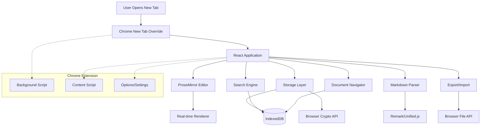

# High Level Architecture

## Technical Summary

This Chrome extension employs a client-side only architecture using Manifest V3 with React/TypeScript frontend, ProseMirror-based rich text editing, and IndexedDB for local persistence. The system intercepts Chrome's new tab page to provide instant access to a WYSIWYG markdown editor that converts markdown syntax to formatted text in real-time without displaying raw markdown. All data remains local using browser storage APIs with encryption, ensuring complete privacy while delivering Notion-quality editing experience optimized for desktop workflows and sub-500ms load times.

## Platform and Infrastructure Choice

**Platform:** Browser Extension (Chrome Manifest V3)
**Key Services:** Chrome Extension APIs, IndexedDB, Browser Storage APIs
**Deployment Host and Regions:** Chrome Web Store (Global Distribution)

**Rationale:** Browser extension platform chosen because:
- Direct integration with Chrome new tab functionality
- Complete local storage without external dependencies
- Instant availability without separate application installation
- Maximum privacy with no server infrastructure required

## Repository Structure

**Structure:** Monorepo
**Monorepo Tool:** npm workspaces
**Package Organization:** Shared types, UI components, and core editor logic separated for maintainability

## High Level Architecture Diagram

## Architectural Patterns

- **Component-Based Architecture:** React components with TypeScript for type safety and reusability - _Rationale:_ Maintainable UI development with strong typing for complex editor interactions
- **Document-Centric Design:** All functionality centers around document entities and operations - _Rationale:_ Aligns with user mental model of managing multiple notes/documents
- **Real-time Rendering Pipeline:** Immediate markdown-to-rich-text conversion without intermediate states - _Rationale:_ Core differentiator providing Notion-like experience without markdown exposure
- **Local-First Data Architecture:** All persistence and operations happen locally with no external dependencies - _Rationale:_ Maximum privacy and offline functionality as stated in requirements
- **Event-Driven State Management:** React Context and reducers for predictable state updates - _Rationale:_ Manages complex editor state, document switching, and search operations reliably
- **Layered Storage Architecture:** Abstraction layer over browser storage APIs with encryption - _Rationale:_ Enables testing, future migration options, and security requirements